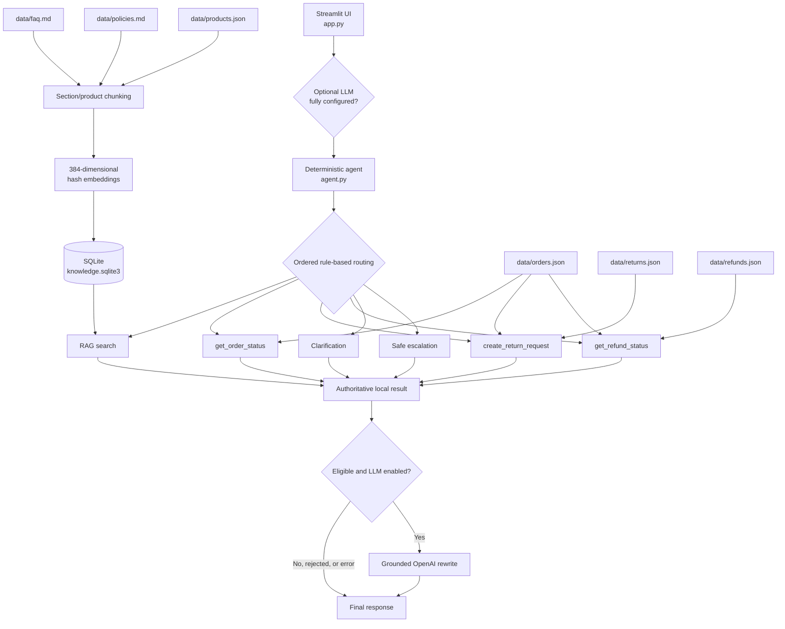

# AI-Powered E-Commerce Customer Support Assistant

A local-first Python and Streamlit demonstration that combines deterministic
intent routing, retrieval-augmented generation (RAG), and three read-only mock
commerce tools. It answers common support questions without requiring an API
key. An optional OpenAI layer can rewrite an answer only after the local agent
has produced an authoritative, grounded result.

## Problem statement

E-commerce support teams repeatedly handle order tracking, returns, refunds,
product specifications, and policy questions. Answers need to be quick and
consistent, while transactional facts must never be invented and requests that
cannot be resolved safely must be clarified or escalated.

This project demonstrates a constrained assistant in which deterministic
routing, local retrieval, and local tool results remain authoritative. It is a
proof of concept, not a production commerce or ticketing integration.

## Supported use cases

- Retrieve shipping, payment, returns, warranty, privacy, and support guidance.
- Answer product catalogue and specification questions.
- Look up the status and tracking details of known demonstration orders.
- Check recorded return eligibility in a non-persistent simulation.
- Look up known refund records.
- Ask for a missing order ID or return reason.
- Escalate unsupported requests, unavailable local data, and low-confidence
  retrieval.

The assistant does not authenticate customers, submit returns, issue refunds,
change orders, contact carriers, or create human-support tickets.

## Architecture



The directory name `chroma_store` is historical. The implemented index is a
standard-library SQLite database; the application does not use ChromaDB or
transformer embeddings.

## Project structure

```text
.
|-- app.py                         Streamlit chat interface
|-- agent.py                       Deterministic routing and response assembly
|-- rag.py                         Chunking, hash embeddings, SQLite retrieval
|-- tools.py                       Three read-only mock commerce tools
|-- llm.py                         Optional grounded OpenAI adapter and fallback
|-- prompts.py                     Tone, safety, and synthesis instructions
|-- config.py                      Project path configuration
|-- evaluate.py                    Deterministic offline evaluation runner
|-- requirements.txt
|-- .env.example                   Optional LLM environment template
|-- data/
|   |-- faq.md
|   |-- policies.md
|   |-- products.json
|   |-- orders.json
|   |-- returns.json
|   |-- refunds.json
|   `-- evaluation_queries.csv
|-- chroma_store/
|   `-- knowledge.sqlite3          Local SQLite retrieval index
|-- report/
|   |-- evaluation_report.md
|   `-- technical_report.md
|-- tests/
|   |-- test_app.py
|   |-- test_agent.py
|   |-- test_evaluate.py
|   |-- test_llm.py
|   |-- test_rag.py
|   `-- test_tools.py
|-- presentation/                  Reserved for presentation material
|-- Sample_Ecommerce_Capstone_Dataset/
`-- Sample_Ecommerce_Capstone_Dataset.zip
```

Runtime code uses the project-ready files under `data/`. The extracted source
directory and ZIP are retained as source inputs.

## How to Run the Application

Python 3.10 or newer is recommended. In Windows PowerShell:

```powershell
git clone https://github.com/Purohit1999/ai-ecommerce-customer-support-assistant.git
cd ai-ecommerce-customer-support-assistant
python -m venv .venv
.\.venv\Scripts\Activate.ps1
pip install -r requirements.txt
streamlit run app.py
```

Open `http://localhost:8501` if Streamlit does not open the application
automatically. On first launch, a missing or empty
`chroma_store/knowledge.sqlite3` index is built from the local knowledge files;
a non-empty existing index is reused.

## How to Use the App

Enter a question in the chat box or select a quick action. Useful assessor
examples include:

| Use case | Example question | Handling |
|---|---|---|
| FAQ | `What are the shipping charges?` | RAG retrieves a grounded FAQ answer with citations. |
| Product | `Does the 24-inch monitor have HDMI?` | RAG retrieves the matching product record. |
| Order | `Where is my order ORD-1006?` | The order tool reads the local order record. |
| Return | `Return my order ORD-1001 because I changed my mind.` | The return tool checks recorded eligibility in simulation mode. |
| Refund | `Where is my refund for order ORD-1007?` | The refund tool reads the local refund record. |

RAG handles informational FAQ, policy, and product questions. The order, return,
and refund tools handle customer-specific queries when the required details are
present. Missing an order ID or return reason produces a clarification request.
Unsupported requests produce human-escalation guidance; for example,
`Book me a flight to Paris` routes to human support.

All transactional records are synthetic demonstration data. Return requests are
simulations only and are never submitted or persisted.

## Offline/default mode

Offline deterministic operation is the default. It needs no API key and makes no
model-provider request. The rule-based agent returns the RAG- or tool-grounded
answer directly.

Offline behavior remains in effect unless every optional LLM setting is present
and explicitly enabled. Clarifications, escalations, unsuccessful tool results,
adapter failures, and rejected generated text always retain the local answer.

## Optional grounded OpenAI configuration

Optional OpenAI LLM integration is implemented and adapter-tested, but
live-provider execution was not tested. No claim is made about live API
validation, model behavior, latency, or cost.

Use `.env.example` as the configuration template:

```text
SUPPORT_LLM_ENABLED=false
SUPPORT_LLM_PROVIDER=openai
SUPPORT_LLM_MODEL=
OPENAI_API_KEY=
```

The application reads the process environment and does not load `.env` files
automatically. Set the values in the shell or deployment environment. For
PowerShell:

```powershell
$env:SUPPORT_LLM_ENABLED = "true"
$env:SUPPORT_LLM_PROVIDER = "openai"
$env:SUPPORT_LLM_MODEL = "<configured-model>"
$env:OPENAI_API_KEY = "<secret>"
streamlit run app.py
```

Do not commit populated secrets. Restart Streamlit or clear its resource cache
after changing these variables because the agent is cached.

The deterministic agent always routes and executes first. Only successful RAG,
order, return, and refund results are eligible for rewriting. The adapter receives
the original query and the authoritative answer, citations, and tool result. A
strict vocabulary-based grounding check rejects added facts; exceptions also
fall back to the unchanged local answer. The LLM does not select or call tools,
so this is not autonomous LLM tool calling.

## RAG design

The offline RAG pipeline is deterministic and dependency-light:

1. `data/faq.md` and `data/policies.md` are split by level-two Markdown section.
2. Sections over about 1,200 characters are split near readable boundaries with
   120 characters of overlap.
3. Each item in `data/products.json` becomes one structured product chunk.
4. Lowercase alphanumeric unigrams and adjacent bigrams are hashed with BLAKE2b
   into signed, L2-normalized, 384-dimensional vectors.
5. Text, metadata, and JSON-encoded vectors are stored in
   `chroma_store/knowledge.sqlite3`.
6. A query uses the same embedding function; all stored vectors are ranked by a
   cosine-equivalent dot product, with deterministic chunk-ID tie-breaking.

The current corpus produces 18 chunks: 6 from `faq.md`, 7 from `policies.md`,
and 5 from `products.json`. Results include text, source, citation, section
metadata, chunk ID, and score. A top score below `0.05` causes safe escalation.

## Three mock tools

- `get_order_status(order_id)` reads `data/orders.json` and returns a known
  order record, including status and available tracking details.
- `create_return_request(order_id, reason)` reads `data/orders.json` and
  `data/returns.json`, reports recorded eligibility, and always marks the action
  as simulated and not persisted.
- `get_refund_status(order_id)` reads `data/orders.json` and
  `data/refunds.json`, distinguishing an unknown order from a known order with
  no refund.

Inputs are normalized and validated. Malformed IDs, unknown records, and
unavailable data return structured JSON-friendly results rather than invented
facts. The demo files contain 9 orders, 5 returns, 4 refunds, and 5 products.

## Deterministic routing and safety fallbacks

`agent.py` applies ordered regular-expression and keyword rules. Refund actions
are checked before return actions, then order-status requests, and finally RAG
topics. Account-specific actions require an order ID in `ORD-` plus 4-12 digits
format; a simulated return also requires a reason.

Every agent result contains `route`, `answer`, `sources`, `tool_result`, and
`escalation`. Missing information yields a clarification. Unsupported requests,
retrieval failures, and low-confidence matches yield an advisory human-escalation
message. Unexpected UI-layer errors are converted to the same safe result shape
without exposing an exception. There is no live ticket handoff.

## Streamlit UI

`app.py` provides a dark, customer-facing chat interface with session history,
quick actions for tracking/returns/refunds/policy, distinct user and assistant
messages, route labels, clarification and escalation notices, citation expanders,
local tool-result expanders, and explicit non-persistence notices for returns.
Startup and response failures are displayed as safe support messages without
stack traces.

## Evaluation methodology and results

Run the offline benchmark from the project root:

```powershell
python evaluate.py
```

The evaluator loads 25 curated cases from `data/evaluation_queries.csv`, creates
a temporary index, runs the deterministic agent, and rewrites
`report/evaluation_report.md`. It uses explicit expected routes, nested tool
fields, expected sources/facts, answer grounding, clarification text, and
escalation flags. It uses no LLM judge and measures this fixed regression set,
not production quality.

| Metric | Result |
|---|---:|
| Routing accuracy | 25/25 - 100% |
| Tool correctness | 9/9 - 100% |
| RAG source/grounding correctness | 8/9 - 88.9% |
| Clarification correctness | 4/4 - 100% |
| Escalation correctness | 25/25 - 100% |
| Overall pass rate | 24/25 - 96% |

### Q010 warranty retrieval limitation

Q010 asks, “What warranty comes with electronics?” It routes correctly to RAG,
but lexical feature hashing ranks the privacy-policy chunk above the warranty
chunk. The grounded answer therefore omits the expected `6–24 months` warranty
fact. The benchmark keeps this known failure visible; evaluation accuracy is not
100%.

## Testing

Run the full test suite from the project root. The module form reliably keeps the
project root on Python's import path:

```powershell
python -m pytest
```

The conventional console-script form is also available in a correctly activated
environment:

```powershell
pytest
```

If bare `pytest` reports `ModuleNotFoundError` for project modules, use
`python -m pytest`; some global Python/Anaconda console entry points do not add
the current project root to the import path.

Tests cover RAG indexing/retrieval, all three tools, routing and fallbacks,
Streamlit helpers, deterministic evaluation, and the optional LLM adapter.
Relevant tests block network sockets, temporary directories isolate test indexes,
and return tests verify that the source JSON is unchanged.

## Privacy and safety considerations

- Supplied and generated demonstration records are local and are not real
  customer data.
- Default operation makes no external model calls and needs no credentials.
- Transaction JSON is read-only at runtime; return creation cannot persist a
  business action.
- Unknown facts trigger structured errors, clarification, or escalation rather
  than fabrication.
- Secrets are read from environment variables and are not stored by the project.
- Enabling OpenAI sends the customer query and grounded context to that provider;
  a deployment must establish consent, retention, access-control, redaction, and
  data-governance controls.
- UI fallbacks do not expose internal stack traces or secrets.

## Limitations and future improvements

- Hash embeddings are lexical, not semantic; Q010 demonstrates the consequence.
- SQLite retrieval scans the small collection and is not an approximate
  nearest-neighbour index for large corpora.
- Keyword routing may miss paraphrases, misspellings, or multi-intent requests.
- The curated 25-case evaluation is small and not a production-quality estimate.
- Mock tools have no authentication or real commerce-system connections.
- Returns are simulated and escalation does not create a support ticket.
- The strict LLM grounding validator may reject safe paraphrases.
- The OpenAI adapter has no live-provider validation.

Future work could add a locally packaged semantic embedding model, hybrid and
section-aware ranking, broader adversarial evaluation, authenticated commerce
connectors, explicit confirmation for mutations, operational ticket handoff,
observability, and approved live-provider testing.
