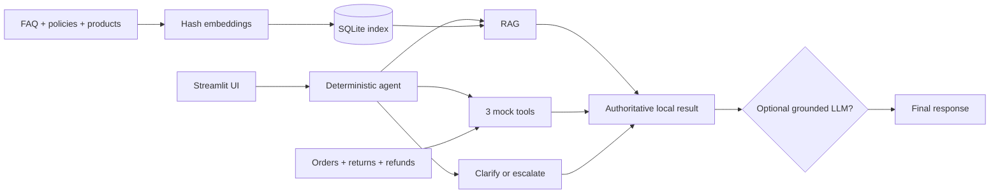

# AI-Powered E-Commerce Customer Support Assistant

Local-first support with deterministic routing, offline RAG, and read-only mock
commerce tools.

- Python and Streamlit proof of concept
- Safe offline/default operation
- Optional grounded OpenAI response rewriting

---

## Problem, persona, and use cases

**Problem:** repetitive support questions need fast, consistent answers without
inventing policy or transactional facts.

**Primary persona:** an online shopper seeking clear self-service help.

**Supported use cases:**

- FAQ, policy, warranty, shipping, payment, and product questions
- Order status and tracking lookup
- Simulated return-eligibility checks
- Refund-status lookup
- Clarification for missing details
- Safe advisory escalation when the assistant cannot resolve a request

This is a demonstration, not a live commerce or ticketing system.

---

## Architecture and data flow

- Local files are authoritative.
- The deterministic agent routes and executes before any optional LLM step.
- Failed or rejected rewrites fall back to the unchanged local result.

---

## Offline RAG design

- Sources: `data/faq.md`, `data/policies.md`, `data/products.json`
- Markdown split by level-two section; one chunk per product
- Long sections: about 1,200 characters with 120-character overlap
- Deterministic BLAKE2b feature hashing over unigrams and bigrams
- Signed, L2-normalized, 384-dimensional vectors
- 18 chunks: 6 FAQ, 7 policy, 5 product
- SQLite persistence: `chroma_store/knowledge.sqlite3`
- Full-scan dot-product ranking; top score below `0.05` escalates

The implementation does not use ChromaDB or transformer embeddings.

---

## Three read-only mock tools

| Tool | Purpose | Local data |
|---|---|---|
| `get_order_status` | Returns a known order and tracking details | `orders.json` |
| `create_return_request` | Reports recorded eligibility | `orders.json`, `returns.json` |
| `get_refund_status` | Returns recorded refunds or a known empty result | `orders.json`, `refunds.json` |

- Inputs are normalized and validated.
- Errors are structured; missing facts are not fabricated.
- Return creation is always a simulation: nothing is submitted or persisted.
- Demo data: 9 orders, 5 returns, 4 refunds, and 5 products.

---

## Agent design and safety

- Ordered rule-based routing: refund, return, order status, then RAG topics
- Account-specific actions require `ORD-` plus 4–12 digits
- Return checks also require a reason
- Stable result schema: route, answer, sources, tool result, escalation
- Missing inputs produce a clarification
- Unsupported, unavailable, or low-confidence cases recommend human support
- UI fallbacks hide stack traces and preserve a safe response shape

Routing and tool selection are deterministic; there is no autonomous LLM tool
calling and no live ticket handoff.

---

## Optional grounded OpenAI layer

- Offline mode is the default and requires no API key.
- `.env.example` documents the enable flag, provider, model, and API key.
- The deterministic agent always produces the authoritative answer first.
- Only successful RAG/order/return/refund results are eligible for rewriting.
- A strict vocabulary check rejects added facts.
- Clarifications, escalations, tool failures, adapter errors, and unsafe output
  keep the original local answer.

**Status:** OpenAI integration is optional and adapter-tested, but it was **not
live-provider tested**. No live API validation is claimed.

---

## Streamlit UI and demo flow

1. Start with `streamlit run app.py`.
2. Ask a question or choose tracking, return, refund, or policy quick actions.
3. Review the assistant answer and route label.
4. Expand citations for RAG answers or local results for tool answers.
5. Observe clarification, escalation, or return-simulation notices when relevant.

The dark chat UI keeps session history, separates user and assistant messages,
and converts unexpected failures into safe support guidance.

---

## Evaluation results

Deterministic offline benchmark: **25 cases**, temporary index, explicit expected
routes/facts/fields, and no LLM judge.

| Metric | Result |
|---|---:|
| Routing | **100%** |
| Tools | **100%** |
| RAG grounding | **88.9%** |
| Clarification | **100%** |
| Escalation | **100%** |
| Overall | **96%** |

**Q010 limitation:** the broad electronics-warranty query routes to RAG, but
lexical hashing ranks the privacy section above warranty guidance. The answer
misses the expected **6–24 months** fact, so accuracy is not 100%.

---

## Limitations and roadmap

- Lexical hash embeddings can miss semantic intent, as Q010 demonstrates.
- Full-scan SQLite ranking is designed for a small local corpus.
- Keyword routing may miss paraphrases, spelling errors, and multi-intent queries.
- The 25-case benchmark is a regression set, not a production-quality estimate.
- Mock tools provide no authentication or live commerce integrations.
- Returns are simulated; escalation does not create a ticket.
- The strict rewrite validator may reject safe paraphrases.
- Live OpenAI behavior, latency, cost, and controls remain unvalidated.

### Roadmap

- Locally packaged semantic embeddings and hybrid/section-aware ranking
- Larger adversarial and paraphrase-focused evaluation sets
- Authenticated commerce connectors with explicit mutation confirmation
- Operational human-support ticket handoff
- Observability, audit trails, and deployment governance
- Approved live-provider testing in a secured environment

The design keeps grounded local evidence and deterministic safety controls at the
centre of each future extension.
